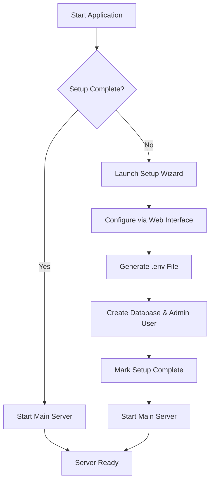

# 🚀 Enhanced Universal Logging Platform - Initial Setup Guide

## Quick Start (Recommended)

### 🎮 Option 1: Web-Based Setup Wizard (Easiest)
```bash
# Windows
start.bat

# Linux/macOS  
chmod +x start.sh && ./start.sh

# Or directly with Node.js
npm start
```

This will:
1. ✅ Check if Node.js and dependencies are installed
2. 🔧 Launch the web-based setup wizard if first-time installation
3. 🌐 Open `http://localhost:10180` for configuration (same port as main app!)
4. 🚀 Automatically transition to main server and redirect to login page
5. 🔐 No manual restart required - seamless experience!

### 🖥️ Option 2: Command Line Setup
```bash
# Interactive CLI setup
npm run setup-cli

# Then start the server
npm run server
```

### ⚡ Option 3: Environment Variable Setup
```bash
# Set your admin password
export AUTH_PASSWORD="YourSecurePassword123!"

# Start server directly
npm run server
```

## 🎯 Web Setup Wizard Features

The initial setup wizard (`http://localhost:3001`) provides:

### 📋 Administrative Account Setup
- **Username**: Default is `admin` (customizable)
- **Email**: Administrator email address
- **Password**: Secure password (minimum 12 characters)

### ⚙️ Server Configuration
- **Port**: Server port (default: 10180 - Docker ready)
  - ⚠️ **Docker Users**: If you change this port, update your Docker port mapping too!
  - Example: Port 8080 → Docker: `-p 8080:8080` or `"8080:8080"`
- **SSL/HTTPS**: Optional SSL certificate configuration
- **Log Retention**: Days to keep logs (default: 30)

### 🔧 Feature Configuration
- **Metrics**: Enable/disable system metrics
- **Alerting**: Enable/disable alert system
- **Advanced Search**: Always enabled
- **Distributed Tracing**: Always enabled

### 🔐 Security Settings
- **JWT Secret**: Auto-generated secure token
- **Session Secret**: Auto-generated session key
- **Bcrypt Rounds**: Secure password hashing (default: 12)

## 📁 What Gets Created

After successful setup:

```
logging-server/
├── .env                     # Environment configuration
├── data/
│   ├── setup-complete.json  # Setup completion marker
│   └── databases/
│       └── logs.db         # SQLite database with admin user
└── logs/                   # Application logs
```

### 📄 Generated .env File
```env
# Authentication
AUTH_PASSWORD=YourSecurePassword123!
JWT_SECRET=auto-generated-secure-key

# Server Configuration
PORT=10180
NODE_ENV=production

# SSL Configuration (if enabled)
USE_HTTPS=false
SSL_CERT_PATH=/path/to/cert.pem
SSL_KEY_PATH=/path/to/key.pem

# Features
ENABLE_METRICS=true
ENABLE_ALERTING=true
ENABLE_DISTRIBUTED_TRACING=true
ENABLE_ADVANCED_SEARCH=true

# Data Management
LOG_RETENTION_DAYS=30
CLEANUP_INTERVAL_HOURS=24

# Security
BCRYPT_SALT_ROUNDS=12
SESSION_SECRET=auto-generated-session-key
```

## 🔄 Setup Process Flow



## 🛠️ Manual Setup (Advanced)

If you prefer manual configuration:

1. **Create `.env` file** with required variables
2. **Create admin user** using CLI: `npm run setup-cli`
3. **Create setup marker**: `mkdir -p data && echo '{"completed": true}' > data/setup-complete.json`
4. **Start server**: `npm run server`

## 🆘 Troubleshooting

### Setup Wizard Won't Start
- Ensure Node.js 14+ is installed
- Run `npm install` to install dependencies
- Check port 3001 is available

### Database Issues
- Delete `data/databases/logs.db` and re-run setup
- Ensure write permissions to `data/` directory

### Environment Variables Not Loading
- Check `.env` file exists and is properly formatted
- Restart server after modifying `.env`

### SSL Configuration
- Ensure certificate files exist and are readable
- Use absolute paths for SSL certificate and key files

## 🔐 Security Best Practices

1. **Strong Admin Password**: Minimum 12 characters with mixed case, numbers, symbols
2. **Change Default Credentials**: Update admin password after first login
3. **Environment Security**: Keep `.env` file secure, never commit to version control
4. **SSL Certificate**: Use valid SSL certificates in production
5. **Network Security**: Configure firewall rules for your chosen port

## 📊 Post-Setup Access

After successful setup:

1. **Dashboard**: `http://localhost:10180` (or `https://` if SSL enabled)
2. **Login**: Use your configured admin credentials
3. **Admin Panel**: Full system administration interface
4. **API Access**: RESTful API for programmatic access

## 🔄 Reconfiguring

To reconfigure the system:

1. **Delete setup marker**: Remove `data/setup-complete.json`
2. **Optional**: Remove `.env` file for full reconfiguration
3. **Restart**: Run setup process again

The system will detect missing configuration and restart the setup wizard.

## 📞 Support

- **Documentation**: Check `SETUP_GUIDE.md` for detailed configuration
- **Validation**: Run `npm run validate` to check system health
- **Logs**: Check `logs/` directory for detailed error information